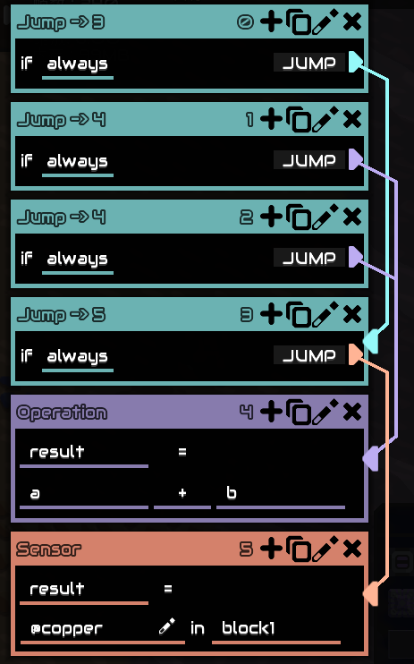

[English](README.md) | [中文](README_CN.md)

# 跳转线着色

为 Mindustry logic 编辑器中的 jump 跳转线按目标着色，跳转到同一目标的线条颜色相同，便于区分不同跳转分支。



## 着色模式

在 **设置 → 跳转线着色** 中配置：

| 模式 | 说明 | 特点 |
|------|------|------|
| 关闭 | 白色 | 不着色 |
| 分散色 | 按目标序号（黄金角度） | 颜色丰富，添加积木时会变 |
| 积木色 | 按目标积木类别颜色（加亮） | 颜色稳定，添加积木不变色 |

## 安装

将文件夹放入 Mindustry mods 目录：
- Windows: `%LOCALAPPDATA%\Mindustry\mods\`
- 或通过游戏内 Mods 菜单导入文件夹/zip

## 兼容性

- 最低版本：157.1
- 多人兼容：是
- 语言：中文 / English

## 工作原理

JS 脚本模组，通过替换 `JumpButton.update` 回调实现着色。

因 `button.to` 为包私有字段（JS/Rhino 无法访问），改用全 public 链路：

```
curve.button -> button.elem -> elem.st -> st.dest -> dest.index / dest.st.category().color
```

- **分散色模式**：黄金角度 (137.508) HSV 颜色生成
- **积木色模式**：使用 `dest.st.category().color` 提亮 1.4 倍
